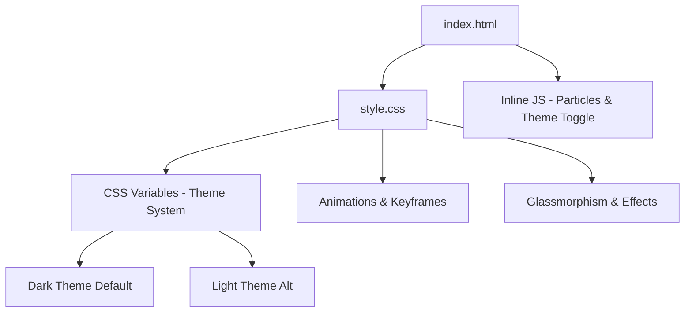

# Design Document: Linktree Design Improvement

## Overview

Enhance the HSD Tarsus linktree page with modern visual effects including animated particle backgrounds, glassmorphism wrapper, micro-interactions, gradient typography, and a dark/light theme toggle. All improvements are pure CSS/HTML/JS with no external dependencies beyond the existing Google Fonts import.

## Architecture



## Components and Interfaces

### Component 1: Animated Particle Background

**Purpose**: Add depth with floating dots/particles behind content

**Implementation**:
```html
<canvas id="particles" class="particle-canvas"></canvas>
```

```css
.particle-canvas {
  position: fixed;
  inset: 0;
  z-index: 0;
  pointer-events: none;
  opacity: 0.6;
}
```

```javascript
// Lightweight canvas particle system (~30 particles, no library)
function initParticles(canvas) {
  const ctx = canvas.getContext('2d');
  const particles = Array.from({length: 30}, () => ({
    x: Math.random() * canvas.width,
    y: Math.random() * canvas.height,
    radius: Math.random() * 2 + 1,
    vx: (Math.random() - 0.5) * 0.3,
    vy: (Math.random() - 0.5) * 0.3,
    opacity: Math.random() * 0.5 + 0.2
  }));
  // Animation loop with requestAnimationFrame
}
```

### Component 2: Glassmorphism Content Wrapper

**Purpose**: Wrap entire content in a frosted glass card for visual separation

```css
.glass-wrapper {
  background: rgba(255, 255, 255, 0.03);
  backdrop-filter: blur(20px);
  -webkit-backdrop-filter: blur(20px);
  border: 1px solid rgba(255, 255, 255, 0.08);
  border-radius: 24px;
  padding: 48px 24px;
  box-shadow: 0 8px 32px rgba(0, 0, 0, 0.3);
}
```

### Component 3: Gradient Text Title

**Purpose**: Make the "HSD Tarsus" title pop with animated gradient

```css
.profile h1 {
  background: linear-gradient(135deg, #ffffff, #e94560, #ffffff);
  background-size: 200% auto;
  -webkit-background-clip: text;
  -webkit-text-fill-color: transparent;
  animation: gradientShift 3s ease-in-out infinite;
}

@keyframes gradientShift {
  0%, 100% { background-position: 0% center; }
  50% { background-position: 100% center; }
}
```

### Component 4: Floating Gradient Orbs

**Purpose**: Ambient animated blobs in background for depth

```css
.orb {
  position: fixed;
  border-radius: 50%;
  filter: blur(80px);
  opacity: 0.15;
  animation: orbFloat 8s ease-in-out infinite;
  pointer-events: none;
}

.orb-1 {
  width: 300px; height: 300px;
  background: #e94560;
  top: -100px; right: -100px;
}

.orb-2 {
  width: 250px; height: 250px;
  background: #0f3460;
  bottom: -80px; left: -80px;
  animation-delay: -4s;
}
```

### Component 5: Noise Texture Overlay

**Purpose**: Subtle grain texture for premium feel

```css
.noise-overlay {
  position: fixed;
  inset: 0;
  pointer-events: none;
  z-index: 999;
  opacity: 0.03;
  background-image: url("data:image/svg+xml,..."); /* inline SVG noise */
  mix-blend-mode: overlay;
}
```

### Component 6: Micro-interactions

**Purpose**: Ripple on click, pulse on icon hover

```css
.link-card::after {
  content: '';
  position: absolute;
  inset: 0;
  background: radial-gradient(circle at var(--ripple-x) var(--ripple-y), 
    rgba(233, 69, 96, 0.3), transparent 60%);
  opacity: 0;
  transition: opacity 0.5s;
  border-radius: 16px;
}

.link-card:active::after {
  opacity: 1;
}

.icon-wrapper:hover {
  animation: iconPulse 0.6s ease;
}

@keyframes iconPulse {
  0%, 100% { transform: scale(1); }
  50% { transform: scale(1.15); }
}
```

### Component 7: Link Category Separators

**Purpose**: Group links by platform type (Sosyal Medya, Topluluk)

```html
<div class="link-separator">
  <span>Sosyal Medya</span>
</div>
```

```css
.link-separator {
  display: flex;
  align-items: center;
  gap: 12px;
  margin: 20px 0 12px;
  color: rgba(255, 255, 255, 0.3);
  font-size: 0.7rem;
  font-weight: 600;
  letter-spacing: 2px;
  text-transform: uppercase;
}

.link-separator::before,
.link-separator::after {
  content: '';
  flex: 1;
  height: 1px;
  background: linear-gradient(90deg, transparent, rgba(255,255,255,0.1), transparent);
}
```

### Component 8: Theme Toggle

**Purpose**: Allow switching between dark and light themes

```html
<button class="theme-toggle" aria-label="Tema değiştir">
  <svg class="sun-icon">...</svg>
  <svg class="moon-icon">...</svg>
</button>
```

```css
:root {
  --bg-primary: #0a0a1a;
  --bg-card: rgba(255, 255, 255, 0.03);
  --text-primary: #ffffff;
  --text-secondary: rgba(255, 255, 255, 0.4);
  --accent: #e94560;
  --border: rgba(255, 255, 255, 0.08);
}

[data-theme="light"] {
  --bg-primary: #f5f5f7;
  --bg-card: rgba(255, 255, 255, 0.7);
  --text-primary: #1a1a2e;
  --text-secondary: rgba(0, 0, 0, 0.5);
  --accent: #e94560;
  --border: rgba(0, 0, 0, 0.08);
}
```

### Component 9: Tagline Animation

**Purpose**: Animated typing or rotating tagline under subtitle

```css
.tagline {
  color: rgba(255, 255, 255, 0.5);
  font-size: 0.8rem;
  margin-top: 8px;
  overflow: hidden;
  white-space: nowrap;
  border-right: 2px solid var(--accent);
  animation: typing 3s steps(30) 1s forwards, blink 0.7s step-end infinite;
  width: 0;
  max-width: fit-content;
  margin-inline: auto;
}

@keyframes typing {
  to { width: 100%; }
}

@keyframes blink {
  50% { border-color: transparent; }
}
```

## Data Models

No data models needed — this is a purely visual/static enhancement.

## Example Usage

```html
<body data-theme="dark">
  <!-- Background effects -->
  <div class="orb orb-1"></div>
  <div class="orb orb-2"></div>
  <canvas id="particles" class="particle-canvas"></canvas>
  <div class="noise-overlay"></div>

  <!-- Theme toggle -->
  <button class="theme-toggle" aria-label="Tema değiştir">🌙</button>

  <!-- Main content in glass wrapper -->
  <div class="container">
    <div class="glass-wrapper">
      <div class="profile">
        <div class="profile-img-wrapper">
          
        </div>
        <h1>HSD Tarsus</h1>
        <p class="subtitle">Tarsus Üniversitesi</p>
        <p class="tagline">Yazılım & Teknoloji Topluluğu</p>
      </div>

      <div class="links">
        <div class="link-separator"><span>Sosyal Medya</span></div>
        <!-- LinkedIn & Instagram cards -->

        <div class="link-separator"><span>Topluluk</span></div>
        <!-- WhatsApp cards -->
      </div>

      <footer>...</footer>
    </div>
  </div>

  <script>
    // Particle init
    // Theme toggle logic with localStorage persistence
  </script>
</body>
```

## Error Handling

- Canvas particle system gracefully degrades if canvas not supported
- `backdrop-filter` has `-webkit-` prefix fallback; solid background fallback for unsupported browsers
- Theme preference persisted in `localStorage`; defaults to dark if no preference
- Reduced motion: respect `prefers-reduced-motion` media query to disable animations

```css
@media (prefers-reduced-motion: reduce) {
  *, *::before, *::after {
    animation-duration: 0.01ms !important;
    transition-duration: 0.01ms !important;
  }
  .particle-canvas { display: none; }
}
```

## Testing Strategy

Manual visual testing:
- Check all animations render smoothly on Chrome, Firefox, Safari
- Verify theme toggle persists across page reload
- Test on mobile (375px) and desktop (1440px)
- Verify `prefers-reduced-motion` disables animations
- Check accessibility: contrast ratios, focus indicators on theme toggle

## Performance Considerations

- Particle canvas limited to 30 particles with `requestAnimationFrame`
- Use `will-change: transform` sparingly (only on animated orbs)
- Noise overlay uses inline SVG data URI (no extra network request)
- All animations use `transform` and `opacity` only (GPU-composited)
- Theme toggle uses CSS variables (single repaint, no layout thrash)

## Dependencies

- None new. Existing: Google Fonts (Inter)
- All effects are pure CSS/HTML/vanilla JS
